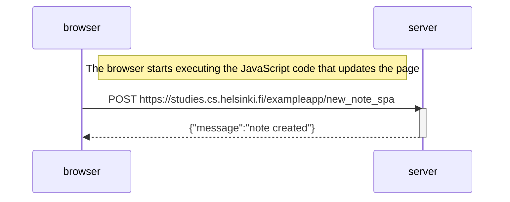

```mermaid
sequenceDiagram
    Note right of browser: The browser starts executing the JavaScript code that updates the page

    browser->>server: POST https://studies.cs.helsinki.fi/exampleapp/new_note_spa
    activate server
    server-->>browser: {"message":"note created"}
    deactivate server
```
